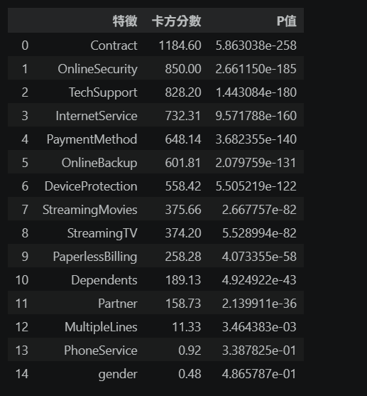

# 📊 SaaS 訂閱制客戶流失與營收衝擊分析 (Telco Churn Analysis)

## 📝 專案背景與目標
在訂閱制 (Subscription) 商業模式中，「降低流失率 (Churn Rate)」遠比獲取新客更具效益。
本專案透過 IBM Telco Customer Churn 數據集，結合 **SQL 聚合分析**、**傳統統計檢定**與 **機器學習演算法**，精準定位流失驅動因子，並將流失人數轉化為具體的財務衝擊 (Lost MRR)，進而提出可落地的商業挽回策略。

## 🛠️ 技術棧 (Tech Stack)
*   **資料處理與聚合:** `DuckDB` (SQL), `Pandas`
*   **統計假設檢定:** `SciPy` (Chi-Square Test)
*   **機器學習與特徵工程:** `Scikit-Learn` (Decision Tree, One-Hot Encoding)
*   **資料視覺化:** `Seaborn`, `Matplotlib`

---

## 💡 核心商業洞察 (Key Insights)

### 1. 探索性分析：卡方檢定排行榜 (統計顯著性驗證)
為避免主觀猜測，專案對所有類別變數進行了批次卡方檢定 (Batch Chi-Square Testing)。數據鐵證顯示，**「合約類型 (Contract)」**、**「線上安全 (OnlineSecurity)」**與**「技術支援 (TechSupport)」**包辦了關聯性排行榜前三名 ($P-value < 0.05$)。相反地，性別 (Gender) 則在統計上毫無關聯。

### 2. 機器學習探勘：決策樹尋找隱藏高風險組合
導入 Decision Tree 演算法提取特徵重要性 (Feature Importance)。模型明確指出，除了「合約類型」外，客戶的**「在網年資 (tenure)」**與**「是否使用光纖網路 (Fiber optic)」**合計掌握了近 80% 的流失決策權。這揭示了「年資短 + 高單價光纖」是流失風險最極端的群體。

*(可在此處放上決策樹長條圖截圖：``)*

### 3. 營收流失重災區定位 (SQL 財務量化)
結合上述模型洞察，透過 DuckDB 進行 SQL 多維度交叉聚合，描繪出終極高風險用戶畫像：
*   **最危險客群：** 「月繳合約 (Month-to-month)」+「光纖網路 (Fiber optic)」+「無技術支援 (No Tech Support)」。
*   **流失率：** 高達 **60%** 以上（遠超全站平均 26%）。
*   **財務衝擊：** 該單一客群的流失，每月直接造成鉅額的月重複營收損失 (Lost MRR)。

---

## 🎯 行動建議與策略 (Actionable Recommendations)

基於上述數據，針對公司業務提出以下優化策略：
1.  **支援服務搭售 (Bundling)：** 針對選擇高單價光纖網路的新註冊用戶，系統應預設贈送首月「免費線上技術支援」，在最容易發生裝機問題的初期建立服務壁壘。
2.  **預測性升級方案 (Proactive Upselling)：** 將資源集中在「月約滿 3 個月且無客訴」的健康用戶上，由電銷團隊主動出擊，提供「轉一年約享 85 折」的優惠，利用消費惰性降低每月的退租決策。
